# App Clientes – Portal y Sucursales

Aplicación móvil desarrollada con **React Native (Expo)** que permite a los clientes iniciar sesión, acceder a un portal web, consultar sucursales en un mapa y navegar una pequeña tienda de souvenirs.

La app incluye autenticación, persistencia de sesión local, catálogo de productos y un carrito básico.

---

# Tecnologías utilizadas

- React Native
- Expo
- TypeScript
- Expo Router
- React Native Maps
- Expo Location
- React Native WebView
- AsyncStorage

---

# Funcionalidades principales

## Login

Pantalla de inicio de sesión con:

- Email
- Contraseña

Validaciones implementadas:

- Email con formato válido
- Contraseña no vacía

Características:

- Persistencia de sesión local usando **AsyncStorage**
- Opción para **cerrar sesión**

---

## Home / Menú principal

Pantalla principal con:

- Mensaje de bienvenida con nombre del usuario
- Acceso a las siguientes secciones:

1. Portal Web  
2. Sucursales  
3. Tienda  
4. Perfil

---

## Portal Web

Integración mediante **WebView** para mostrar una página web dentro de la app.

Incluye:

- Loader mientras la página carga
- Manejo de error si no hay conexión a internet
- Botón para abrir la página en el navegador externo

---

## Sucursales

Pantalla que muestra las sucursales de la empresa.

Características:

- Lista de sucursales
- Información de cada sucursal:
  - Nombre
  - Dirección
  - Horario
  - Teléfono

### Mapa

- Mapa con marcadores de cada sucursal
- Al tocar un marcador se muestra información
- Botón **"Cómo llegar"** que abre Google Maps o Apple Maps
- Muestra la **ubicación del usuario** si el permiso es aceptado
- La app sigue funcionando si el usuario rechaza el permiso

---

## Tienda de souvenirs

Sección que muestra un catálogo de productos.

Cada producto incluye:

- Imagen
- Nombre
- Precio
- Botón **Ver detalle**

También incluye un **buscador de productos**.

---

## Detalle de producto

Pantalla con:

- Imagen del producto
- Nombre
- Descripción
- Precio
- Botón **Agregar al carrito**

---

## Carrito

Funcionalidad básica de carrito que permite:

- Ver productos agregados
- Eliminar productos
- Mostrar el total de la compra

(Sin checkout)

---

# Fuente de datos

Los datos se obtienen desde **archivos JSON locales**:

data/users.json  
data/stores.json  
data/products.json  

Esto simula el comportamiento de una API y facilita migrar a un backend real en el futuro.

---

# Decisiones técnicas

### Uso de JSON local

Se utilizaron archivos JSON para manejar los datos de usuarios, sucursales y productos, simulando una fuente de datos sin necesidad de un backend real.

### Persistencia de sesión

Se utilizó **AsyncStorage** para mantener la sesión del usuario incluso después de cerrar la aplicación.

### Navegación

La navegación entre pantallas se implementó utilizando **Expo Router**, lo que permite una estructura de rutas sencilla y escalable.

### Componentización

Se crearon componentes reutilizables como:

- Header
- BottomMenu
- Layout principal

Esto facilita mantener una estructura clara y modular.

---

# Cómo ejecutar el proyecto

## 1. Clonar el repositorio

git clone https://github.com/alejandromendozah/yukapioca-mobile-app.git

## 2. Instalar dependencias

npm install

## 3. Ejecutar el proyecto

npx expo start

Luego:

- Escanear el QR con **Expo Go**

# Librerías utilizadas

expo  
expo-router  
react-native-maps  
expo-location  
react-native-webview  
@react-native-async-storage/async-storage  

# Capturas de pantalla

## Login

   ## Usuario:  jesus.bernal@yukapioca.com
   ## Contraseña:  123456

## Home
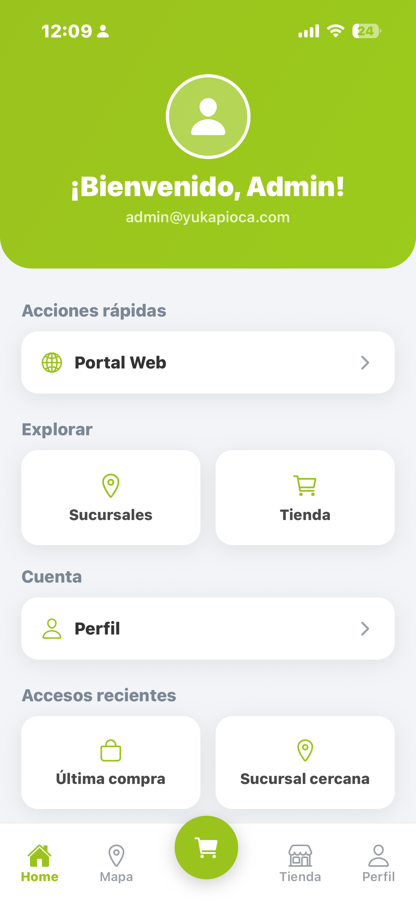

## Página Web
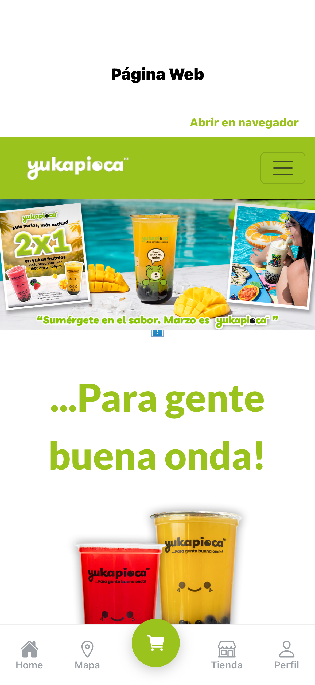

## Loading Página Web

## Sin Conexión Página Web
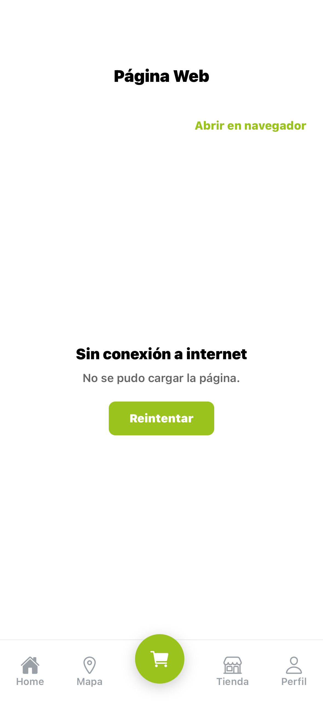

## Sucursales solicita Ubicación
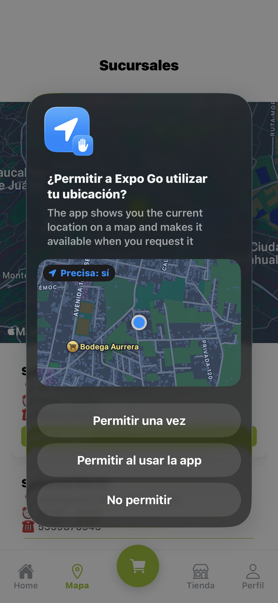

## Sucursales con Ubicación
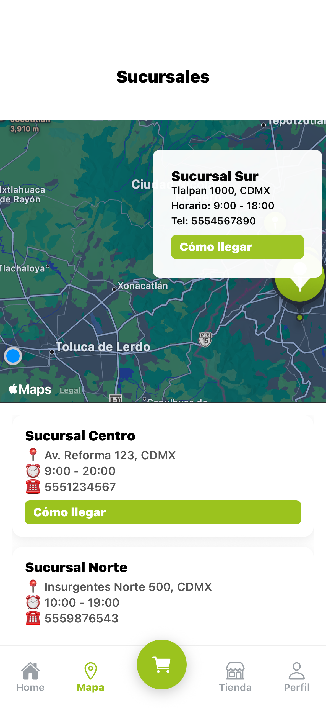

## Sucursales sin Ubicación
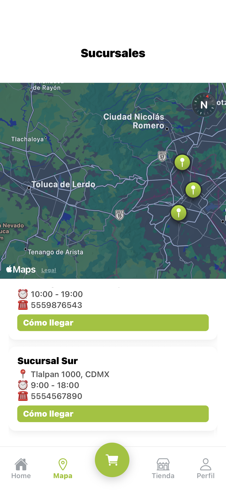

## Tienda
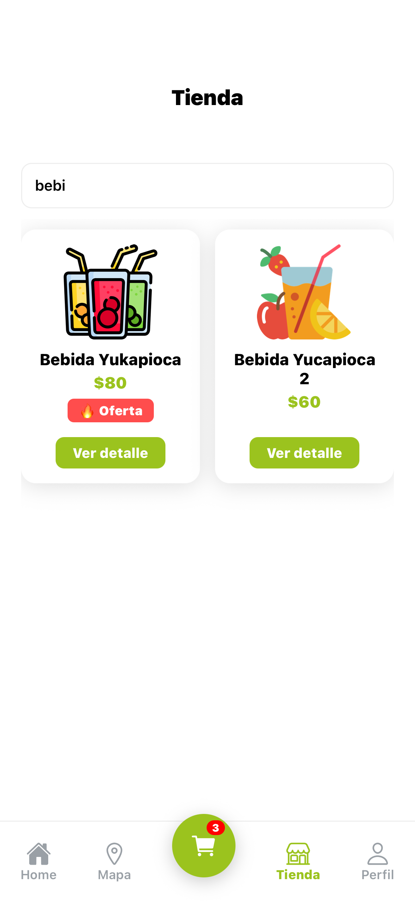

## Detalle Producto
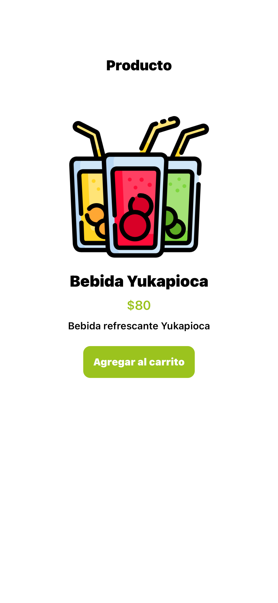

## Carrito
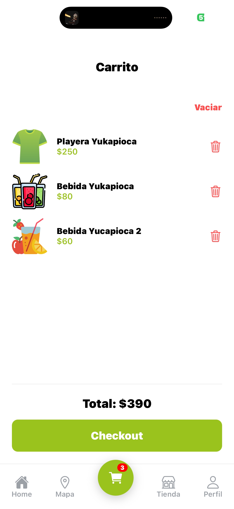

## Carrito Vacio
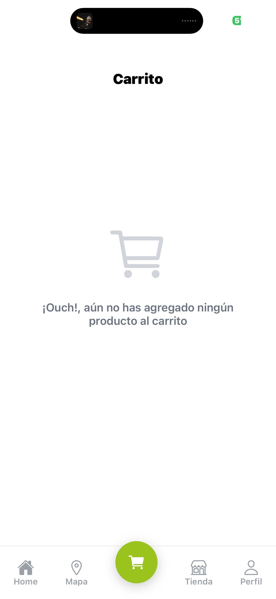

## Perfil
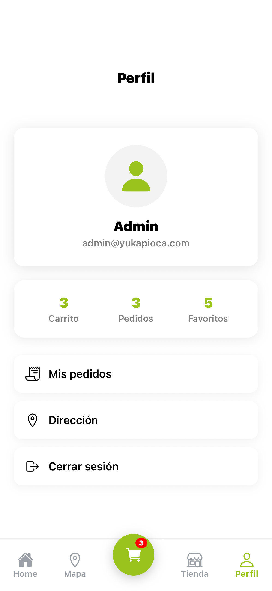

## Confirma Cierre Sesión
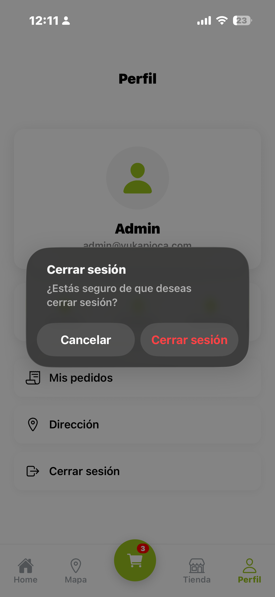

## Implementación Web

## Menú en detalle
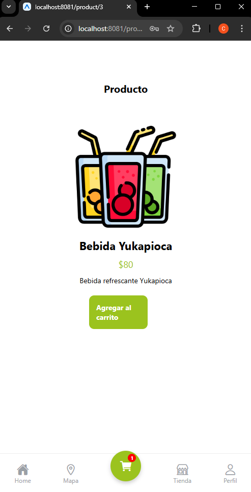

## Mapas en la Web
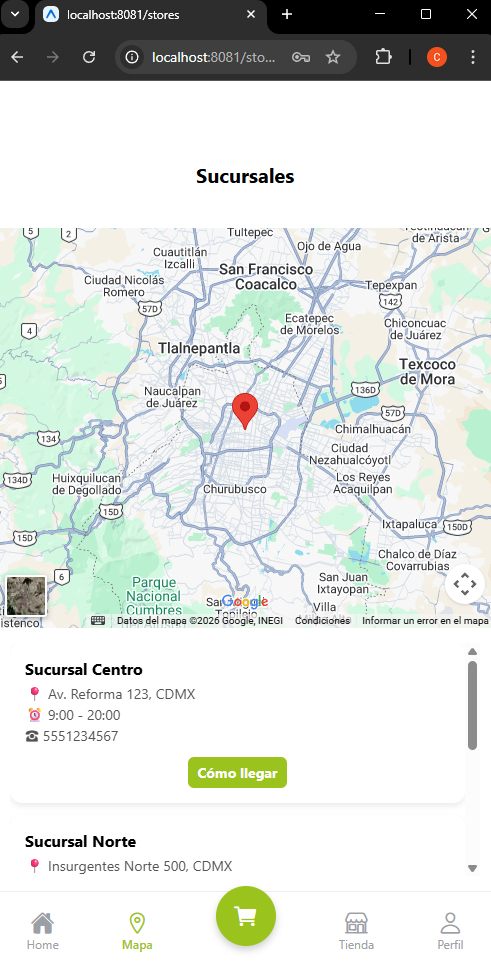

## Manejo de Error en Página Web desde la Web
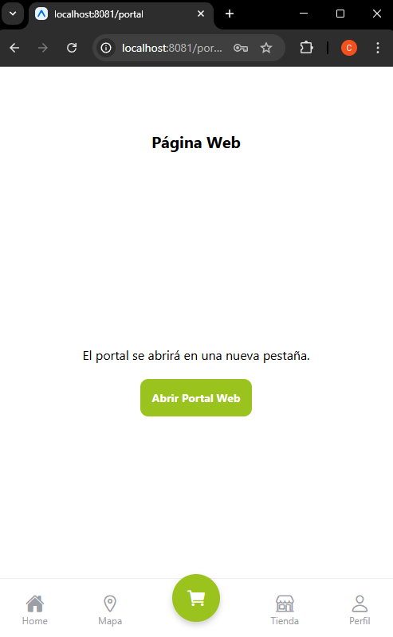

# Prueba técnica, César Alejandro Mendoza Hernández
Proyecto desarrollado como prueba técnica de aplicación móvil.
